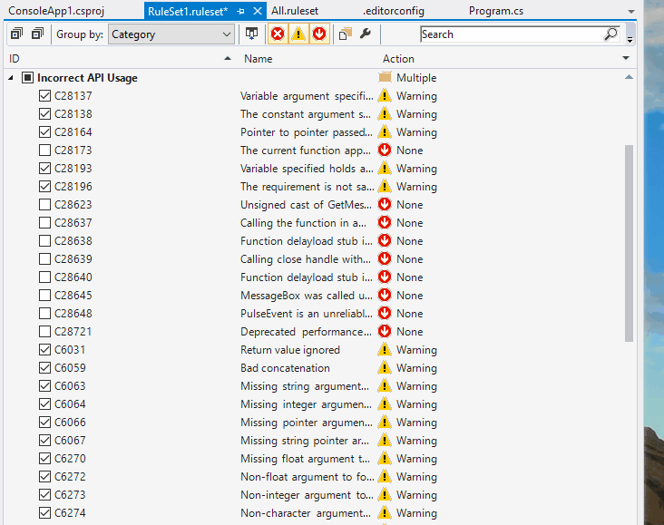

# Set up coding static code analysis with FxCop

Microsoft offers a great way to add static code analysis to .net projects.

## Installation

1. Add a new item "Code Analysis Rule Set" to the solution folder
2. Open the file from within Visual Studio
3. Group the rules by category
4. Either set severity level of each rule or use severity levels from an existing ruleset
5. Add nuget FxCop to each project
6. Rebuild solution

That's it! Now compiler Roslyn shows the issues and Intellisense gives hints how to fix them.

## Customize rules

Styling rules are defined in the .editorconfig file. 
A rule consists of a rule name (e.g. dotnet_style_qualification_for_field), a rule value (e.g. true) and a severity level (e.g. warning).
The rule value should always be set to true.

1. Open "Code Analysis Rule Set"
2. Group them by name or category
3. Check the rule and set severity level
4. Rebuild the solution
5. Fix the warning with quick actions




## Supress Warnings

There are several ways to supress warnings.

### Solution wide

Disable rule in the ruleset file


### Project wide

Add a NoWarn element to csproj file
 
```xml
<PropertyGroup>
  <NoWarn>CS0169</NoWarn>
</PropertyGroup>
```

### Supress warning in a file

Add a compiler directive into the sources

```csharp
#pragma warning disable CS0169  
      private int _unusedVariable;
#pragma warning restore CS0169  
```
## Links

* https://docs.microsoft.com/en-us/visualstudio/code-quality/install-fxcop-analyzers
* https://docs.microsoft.com/en-us/visualstudio/ide/how-to-suppress-compiler-warnings